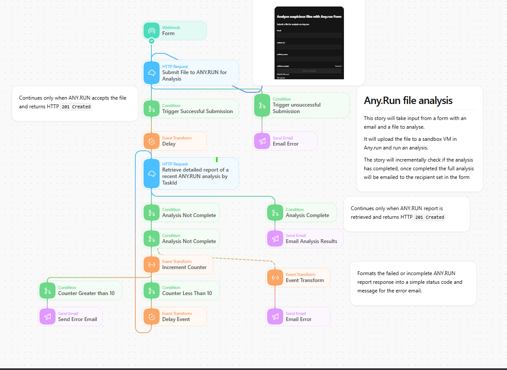

# ANY.RUN File Analysis with AI Summary

## Overview

This Tines Story receives a file through a form, submits it to ANY.RUN, monitors the analysis task, and returns the completed report or an error to the requester.

## What it does

- Collects a file and requester email address through a Tines form.
- Creates an ANY.RUN file-analysis task.
- Repeatedly checks the task until a report is available or the retry limit is reached.
- Delivers the completed analysis or an error notification.

## Input

The form requests an email address and file attachment.

## External services

The workflow requires an ANY.RUN API credential and a configured email delivery action.

## Notes

Only submit files that your organization is permitted to share with the selected sandbox provider. Treat automated verdicts as evidence for analyst review.
