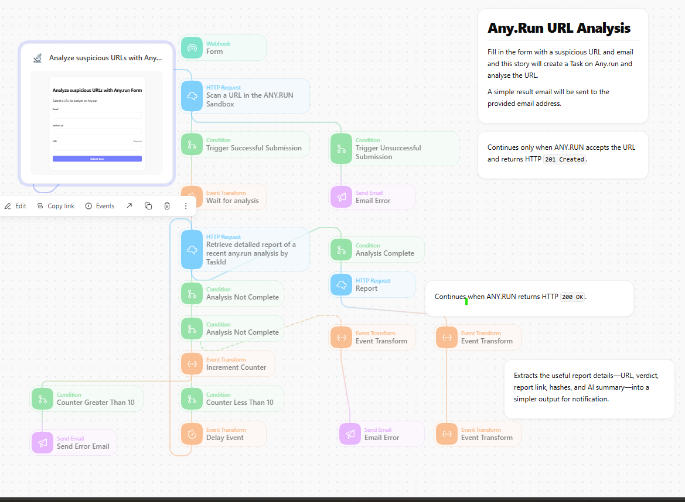

# ANY.RUN URL Analysis with AI Summary

## Overview

This Tines Story receives a suspicious URL through a form, submits it to ANY.RUN, polls the task until it completes, and formats the resulting analysis for the requester.

## What it does

- Collects a URL and requester email address through a Tines form.
- Creates an ANY.RUN URL-analysis task.
- Waits and polls for the task report.
- Handles unsuccessful submissions and incomplete analyses.
- Extracts report details and delivers the configured result summary.

## Input

The form requests an email address and URL.

## External services

The workflow requires an ANY.RUN API credential and a configured email delivery action.

## Notes

Submitting a URL to ANY.RUN may disclose it to that service. Use an account and privacy settings appropriate for the sensitivity of the investigation.
