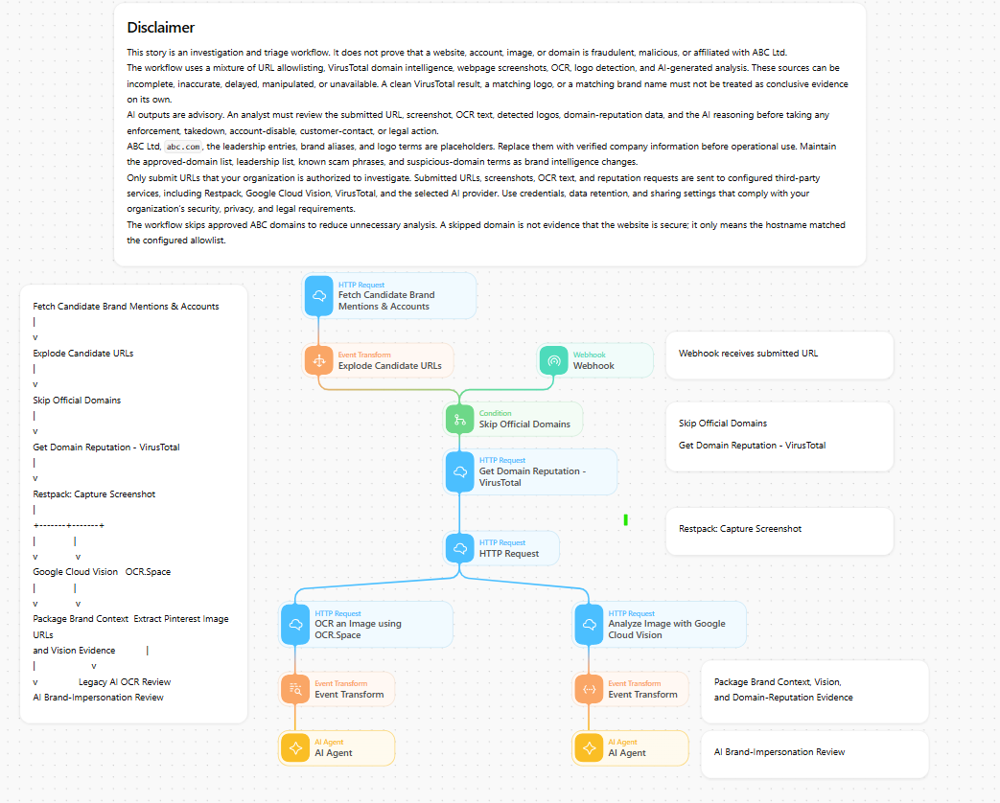

# Brand Monitoring Using OCR

## Overview

This Tines Story triages a submitted suspicious website for potential brand impersonation. It skips configured official domains, gathers domain reputation, captures a screenshot, extracts visual evidence, and compares that evidence with a generic brand-protection context.

## What it does

- Receives a suspicious URL from a webhook or a monitoring source.
- Skips domains listed as official or safe.
- Retrieves domain-reputation evidence from VirusTotal.
- Captures a webpage screenshot with a screenshot-rendering service.
- Uses OCR and logo detection to extract visible text and visual indicators.
- Packages the URL, reputation, OCR, and logo results with an editable `ABC Ltd` brand context.
- Sends the compact evidence set to an AI analysis step for an analyst-facing assessment.

## Input

Submit a URL in the webhook request body. The exact webhook path and secret must be created in your own Tines tenant.

## External services

The template references VirusTotal, a screenshot-rendering service, Google Cloud Vision, OCR.Space, and an AI provider. Configure only the actions and services needed for your environment.

## Notes

The included `ABC Ltd` brand context is a placeholder. Replace the company name, official domains, approved handles, leadership names, known scam patterns, and decision criteria with your own approved information. OCR, logo detection, reputation data, and AI output are investigation signals; an analyst should review the underlying evidence before taking action.
