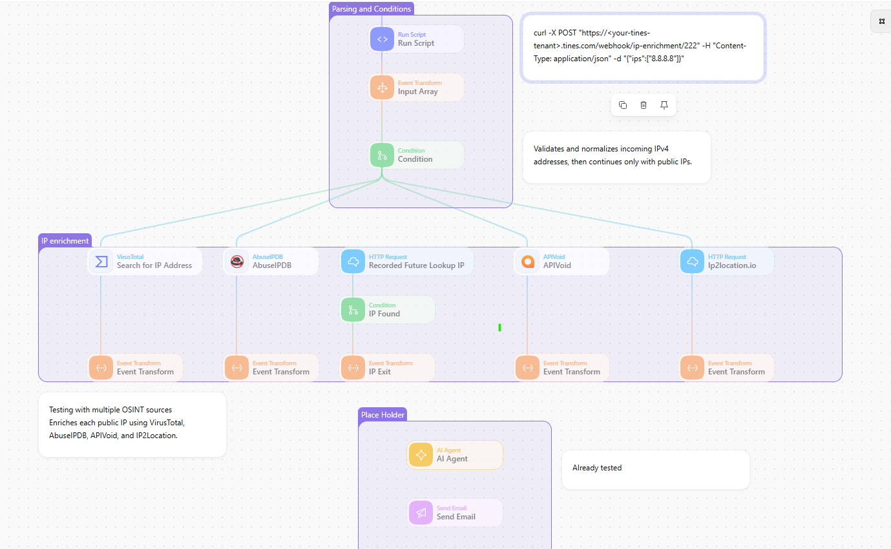

# IP Enrichment

## Overview

This Tines Story accepts IPv4 addresses, validates and normalizes them, and continues only with public addresses. It gathers reputation and context from configured intelligence sources so an analyst can review the results in one investigation.

## What it does

- Accepts a list of IP addresses.
- Filters out private, loopback, and otherwise non-public IP addresses.
- Queries configured providers such as VirusTotal, AbuseIPDB, APIVoid, Recorded Future, and IP2Location.
- Produces structured enrichment data for each investigated IP.

## Input

Provide an array of IPv4 addresses to the story’s input action.

## External services

The included template references VirusTotal, AbuseIPDB, APIVoid, Recorded Future, and IP2Location. Configure only the providers available to your team.

## Notes

The workflow contains credential placeholders only. Provider results are intelligence signals and should be evaluated with the surrounding investigation context.
