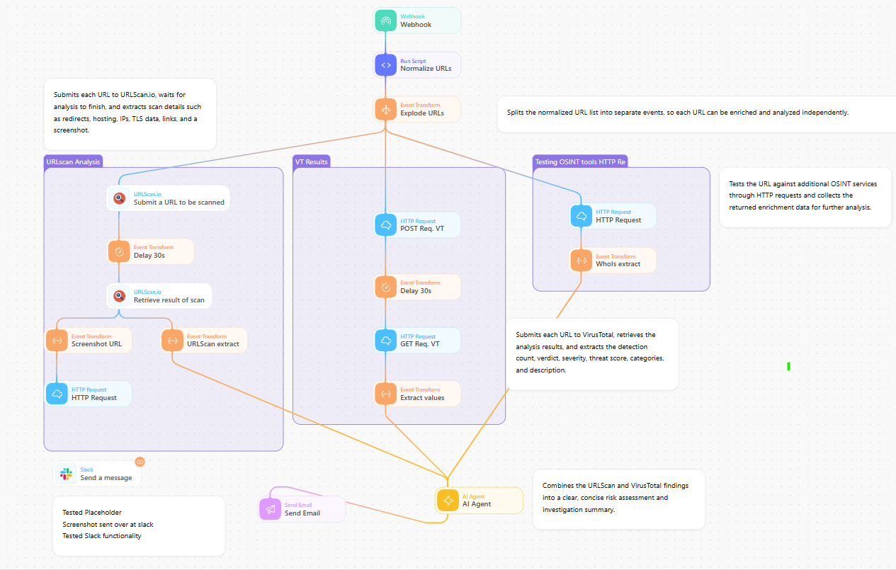

# URL Enrichment

## Overview

This Tines Story accepts one or more URLs, normalizes them, and enriches each URL independently. It combines sandbox and reputation data into a concise investigation record.

## What it does

- Normalizes a submitted list of URLs and creates one event per URL.
- Submits URLs to URLScan.io and retrieves completed scan details, including screenshots and observed infrastructure.
- Submits URLs to VirusTotal and extracts detection, verdict, category, and threat information.
- Collects optional enrichment from additional HTTP-based intelligence sources.
- Sends the resulting evidence to the configured analysis or notification steps.

## Input

Provide a list of URLs to the webhook or input action configured in the imported story.

## External services

The template references URLScan.io and VirusTotal, plus optional HTTP-based enrichment and notification services.

## Notes

URL submission can disclose the URL to third-party providers. Review data-handling requirements before using this workflow with sensitive investigations.
